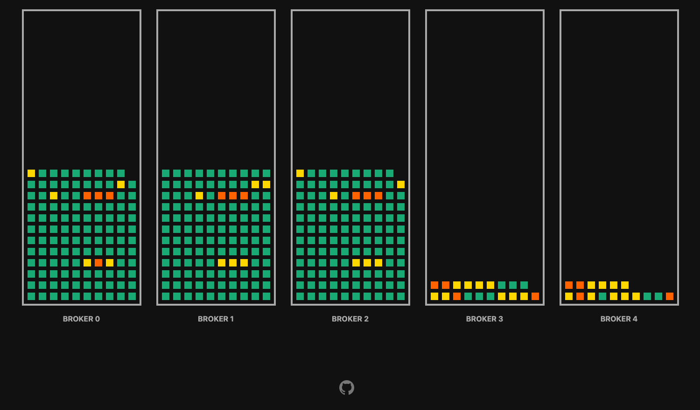

# Kafka Topic View

Kafka Topic View is a simple UI for monitoring Kafka topics and their state.



## TODO

* Configure refresh interval in the UI
* Add SASL support
* Better logging
* CI build

## Usage

### Locally

Run the binary and use the configuration options to configure where it listens and how it connects to Kafka:

Option | Description | Default
------------ | ------------- | ------------- 
`--listen-addr` | The address where the HTTP Server runs | `0.0.0.0:8080`
`--fetch-interval` | The interval at which to fetch the new topic data (default 1m0s) | `1m0s`
`--bootstrap-server` | Comma separate list of Kafka Brokers to connect to | 
`--kafka-version` | Version of the Kafka cluster | `2.5.0`
`--tls-ca-file` | File with the CA certificate for server authentication | 
`--tls-cert-file` | File with the client certificate for client authentication | 
`--tls-insecure-skip-verify` | Skip TLS verification when connecting to the Kafka brokers. Use at your own risk! | 
`--tls-key-file` | File with the key for client authentication | 
`--verbose` | Turn on verbose logging | `false`
`--sarama-verbose` | Turn on verbose logging int he Sarama Kafka client | `false`

### In Kubernetes with Strimzi

Edit the [`deployment-strimzi.yaml` file](./deployment-strimzi.yaml) to match your Strimzi cluster setup (secret names, cluster name, bootstrap servers etc.) and deploy it to Kubernetes:

```
kubectl apply -f deployment-strimzi.yaml
```

Use `kubectl proxy` or `kubectl port-forward` to access the UI.

## Build

Build the Golang backend first:

```
go build
```

If needed, build also the container with the backend and UI:

```
docker build -t <org>/<image>:<tag> ./
```
 